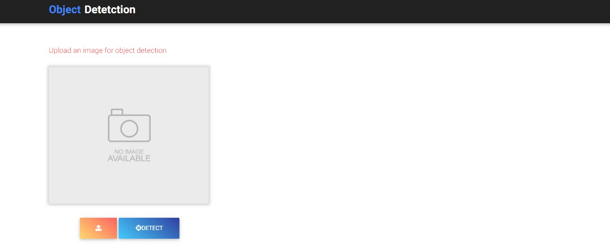
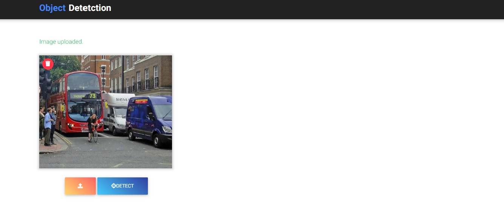
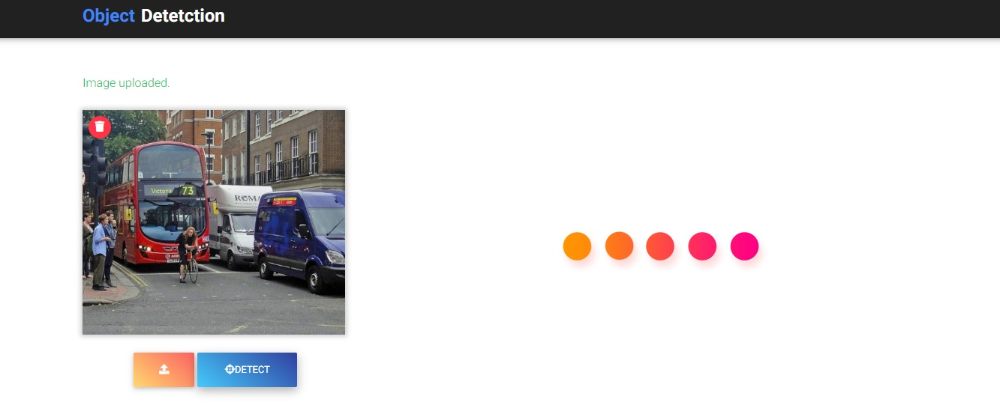
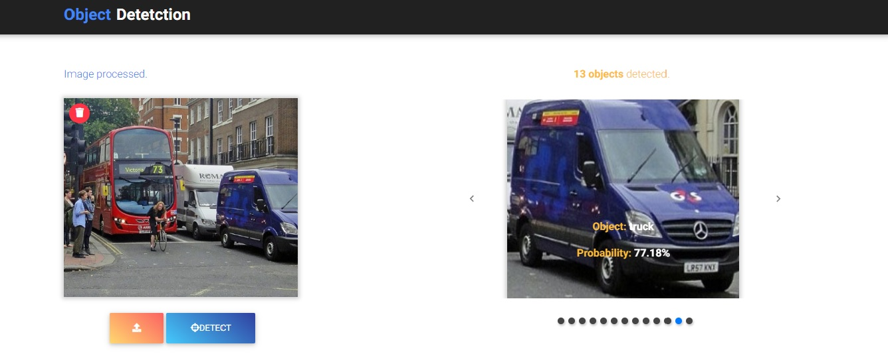

# Object Detection with ImageAI
A minimalistic web application using Flask and ImageAI to detect objects in an image.

## How to use?
1. Clone this repository:
```
git clone https://github.com/sagnikjena/Object_Detection.git <your_folder>
```
2. Create a python virtual environment and install the modules in _requirements.txt_

3. Add a folder called __model__ in the clone directory and download and save the resnet model file there from this [link](https://github.com/OlafenwaMoses/ImageAI/releases/download/1.0/resnet50_coco_best_v2.0.1.h5)

3. Run the app while the environment is active:
```
python obj_detect.py
```
## Highlights from the app

### Landing page:


### Image uploaded:


### Processing uploaded image:


### Result page:


A big shoutout to [Moses Olafenwa](https://twitter.com/OlafenwaMoses), [John Olafenwa](https://twitter.com/johnolafenwa) and the rest of the team at [ImageAI](http://imageai.org/#) for making our lives so much easier.
